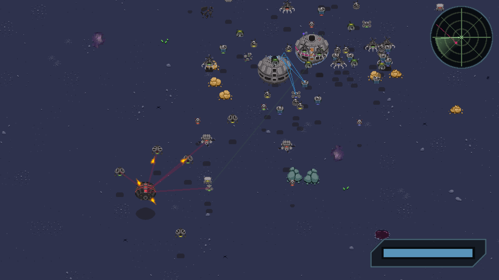

[Roboden in available on Steam!](https://store.steampowered.com/app/2416030/Roboden/)

The **online demo** can be found here: <https://quasilyte.itch.io/roboden>.

## Game Overview

Two robotic life forms collided, and only one will remain. Can you lead the drone-producing colony to victory or will you face defeat?

This game allows you to build units and bases, harvest resources, and explore the hostile world without the direct control you're used to having in most RTS games. Instead of giving a direct unit order, you manipulate the colony's priorities and let it decide what needs to be done (and how it should be done).

Features:

* Split-screen local PvP and co-op multiplayer (requires at least 1 controller)
* Asymmetrical RTS gameplay
* Unique base and units control system
* Neat pixel art graphics
* Units combining system for higher tier units
* About 30 different drones divided into 3 tiers
* 4 game modes: classic, arena, infinite arena, and reverse
* Online leaderboard
* Procedural level generation with extensive customization

If you're playing a browser version of the game, please use Chrome or some other browser that has good wasm support (you may have performance issues in Firefox). If possible, prefer a native build instead; you'll get a smooth 60fps experience this way.



## How to Run

```bash
git clone --depth 1 --recurse-submodules --shallow-submodules https://github.com/quasilyte/roboden-game.git
cd roboden-game/src
go run ./cmd/game --data ../roboden_data
```

> You will need a [go](https://go.dev/) 1.18+ toolchain in order to build this game.

You may need to install [Ebitengine dependencies](https://ebitengine.org/en/documents/install.html#Installing_dependencies):

```bash
# For Debian/Ubuntu
$ sudo apt install libc6-dev libglu1-mesa-dev libgl1-mesa-dev libxcursor-dev libxi-dev libxinerama-dev libxrandr-dev libxxf86vm-dev libasound2-dev pkg-config
```

If you want to build a game for a different platform, use Go cross-compilation:

```bash
GOOS=windows go build -o ../bin/roboden.exe ./cmd/game --data ../roboden_data
```

The `Makefile` contains several helpers to build release binaries. It uses the `./cmd/builder` script to do that.

```bash
# ./cmd/builder can be executed directly
go run ./cmd/builder -goos windows -goarch amd64 -o roboden.exe

# Specify -steam to build a Steam release
go run ./cmd/builder -goos windows -goarch amd64 -steam -o roboden.exe
```

#### Build for web(wasm):

```bash
cd src/
make wasm
```

After that you can open `_web/index.html` in browser (you'll need to serve the wasm file).

#### This game is tested on these targets:

* windows/amd64
* linux/amd64
* darwin/arm64
* js/wasm

It's also tested on Steam Deck.

A native build for Android is planned as well. The game does have a touch screen support already.
