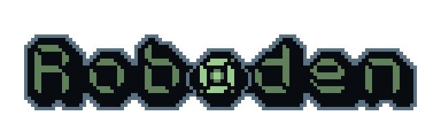

The online demo and release binaries can be found here: <https://quasilyte.itch.io/roboden>.

## Game Overview

Two robotic life forms collided, and only one will remain. Can you lead the drone-producing colony to victory or will you face defeat?

This game allows you to build units and bases, harvest resources, and explore the hostile world without the direct control you're used to having in most RTS games. Instead of giving a direct unit order, you manipulate the colony's priorities and let it decide what needs to be done (and how it should be done).

This game is a "My First Game Jam: Winter 2023" submission. It was created during a single week of development by a team of two.

Features:

* Asymmetrical RTS gameplay
* Unique base and units control system
* Neat pixel art graphics
* Randomized stage generation with customizations
* Unit combining system for higher tier units
* Easy to learn, hard to master game process
* Interactive in-game tutorial
* 14 different drones divided into 3 tiers
* 4 drone factions, each with their own bonuses

If you're playing a browser version of the game, please use Chrome or some other browser that has good wasm support (you may have performance issues in Firefox). If possible, prefer a native build instead; you'll get a smooth 60fps experience this way.

## How to Run

```bash
git clone https://github.com/quasilyte/roboden-game.git
cd roboden-game/src
go run ./cmd/game
```

> You will need a go 1.18+ in order to build this game.

If you want to build a game for a different platform, use Go cross-compilation:

```bash
GOOS=windows go build -o ../bin/decipherism.exe ./cmd/game
```

Put these files into a single archive to create an itch-io uploadable bundle.

This game is tested on these targets:

* windows/amd64
* linux/amd64
* darwin/arm64
* js/wasm
